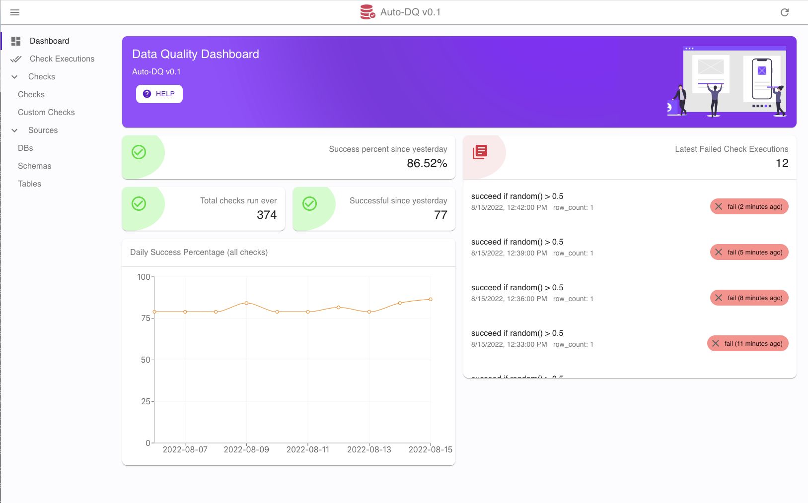
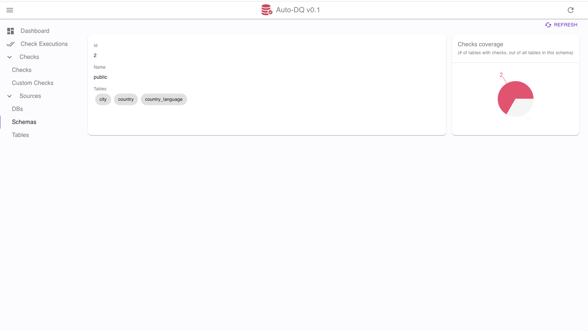
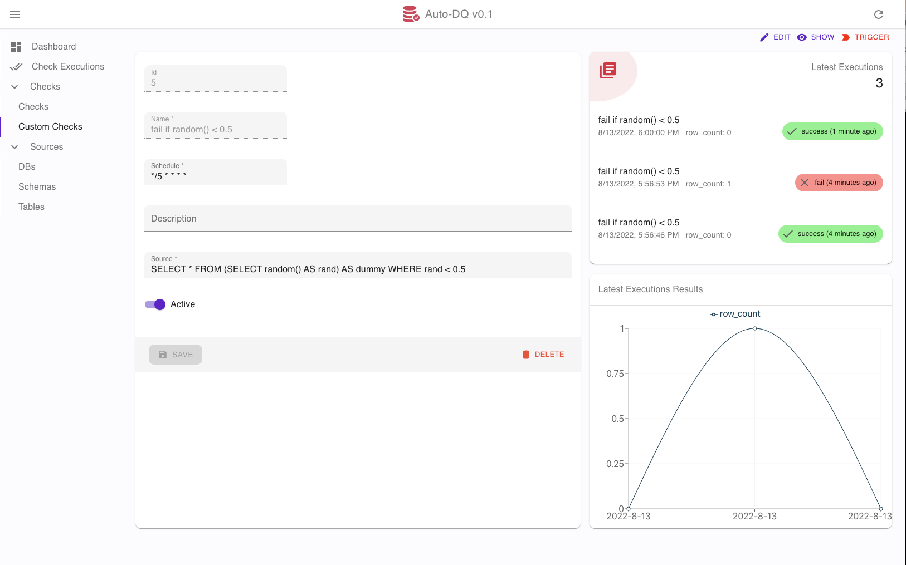
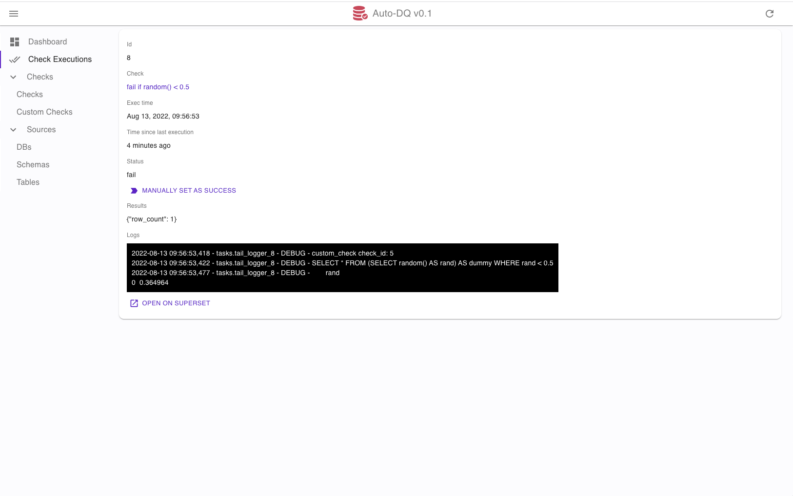

# Auto-DQ (Data Quality)

This project is aimed at managing scheduled DQ checks for a data warehouse. DQ checks are rules that the data must 
follow in order to be correct, such as uniqueness, completion, non-null constraints, consistency... You can also write 
custom SQL that will run as a check. 

So far current supported DQ rules are:

- #### Uniqueness
Checks that all values in a given column are unique.

- #### Outliers
Checks that all values in a given column are within 3 standard deviations from each other.

- #### Freshness
Checks that all values (timestamps) from the input source are within certain time delta

- #### Non-null
Checks that all values from the input source are non-null

- #### Ordered
Checks that all values from the input source are in order (smaller to bigger)

- #### Custom SQL
Free SQL input that runs against the data source and succeeds if empty dataset is returned (no rows) and fails otherwise


# Getting Started

(pre-requirements) Docker and docker-compose.

Auto-DQ can be started by building the backend and frontend Docker images, and launching the containers from the compose
file:
 
1. Build images
    ```
    docker build backend/ -f backend/Dockerfile -t auto-dq-backend:local
    docker build frontend/ -f frontend/Dockerfile -t auto-dq-frontend:local
    ```
2. Init .env (needed first time): `cp backend/.env.template backend/.env`
3. Run it: `docker-compose up -d`

- Admin UI will be available at http://localhost:8001
- Backend server runs on port 8000, you can check the Swagger docs at http://localhost:8000/docs
- There is no authentication built-in, so it is advisable to keep the project inside your private cloud/network 

# About the project

Backend is a rest API built with FastAPI to CRUD on Data Quality models such as checks/check executions... it comes with 
built-in Swagger docs.

DQ checks data is stored on a PostgresSQL DB which runs together with the backend app on the same docker-compose.

For scheduling DQ checks we use [apscheduler](https://apscheduler.readthedocs.io/) which takes care of executing each 
DQ check based on a crontab format.

Frontend UI build with react-admin to interface with DQ backend.

### Containers

Environment uses docker-compose to launch the following containers:
- `db`: PostgresSQL instance to store all metadata.
- `backend`: Uvicorn process to serve the API, port 8000 is exposed.
- `worker`: Celery worker running async tasks (scheduled checks and DB metadata extraction)
- `redis`: Used for celery backend/broker

Volumes for db and celery are stored (gitignored) under `./volumes`

### Folder Structure

- `api/`: Routers and endpoints definitions
- `crud/`: CRUD SQLAlchemy models for interacting with the DB 
- `models/`: Actual SQLAlchemy models
- `schemas/`: Pydantic models for API I/O format
- `services/`: Business logic

Other folders:
- `alembic/`: Migration files
- `core/`: Config files
- `db/`: DB/Session connection details
- `tasks/`: Celery async task definitions 

### Useful Commands

- Add new migrations
```
docker exec -it docker exec -it backend_backend_1 bash
  > alembic revision --autogenerate -m '...dummy migration msg...'
  > alembic upgrade head
```

### Upcoming TODO

- Add support for more DBs (currently only using postgres and presto)
- Support for running checks on partitioned tables
- Move query logic from services/check.py into DB engine spec (different DBs may have different syntax)


# Demo Setup

1. Launch backend and frontend containers as explained above
2.
    - a) Launch sample psql db: `docker run --rm -d --name world-db --publish 5433:5432 ghusta/postgres-world-db:2.6`
    - b) Launch sample mysql db: `docker run --rm -d --name mysql-employees --publish 3306:3306 -e MYSQL_ROOT_PASSWORD=test genschsa/mysql-employees`
3. Open Admin UI (http://localhost:8001) > Sources > DBs > Create >
    (for psql) 
    ```
        Name: world-db
        Type: postgresql
        Hostname: host.docker.internal
        Port: 5433
        Database: world-db
        User: world
        Password: world123
    ```    
    (for mysql: name "employees", port "3306", user: "root", pw: "test")
4. After DB is created you can try "Fetch Schemas", and also try creating both custom and 'normal' checks.


# Admin UI Screenshots
- Admin Dashboard Home


- DB Schema Detail


- Custom Check Detail


- Check Execution Detail


